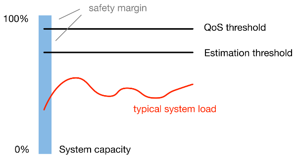

Threshold-based Mesos Oversubscription
======================================

This repository contains two simple
[Mesos oversubscription](http://mesos.apache.org/documentation/latest/oversubscription/) modules:

* `ThresholdResourceEstimator`: Informs the Mesos master about resources that can be oversubscribed
  on the associated agent.

  Similar to the `fixed` resource estimator provided by Mesos, it allows operators to configure a
  fixed amount of oversubscribable revocable resources per agent. However, once system utilization
  reaches a defined treshold, resources will be cut to the currently used amount, avoiding further
  scheduling of revocable tasks.

* `ThresholdQoSController`: Informs the Mesos agent that particular corrective actions need to be
  made to prevent quality-of-service violations (i.e. system overload).

  Following the same principle as the `ThresholdResourceEstimator`, corrective actions are taken
  whenever the system utilization reaches a configurable threshold. The controller kills one
  revocable task per iteration and thus slowly corrects resource estimations that turned out to be
  over-optimistic.

Is it any good?
---------------

The threshold-based approach enabled us to double the CPU and memory utilization in our clusters.
Your mileage may vary significantly, so please take this statement with a grain of salt.

Mechanics
---------

Resource estimator and QoS controller aim to work in unison to ensure that the system load is never
approaching critical levels that could negativly affect non-revocable tasks.

Revocable resources will only be offered if the system utilization remains below the estimation
threshold. If utilization spikes above, no more revocable resources are offered. If it further
surpasses the QoS threshold, the controller will begin to kill revocable tasks until the
utilization drops. Assuming the utilization drops below the QoS but not below the estimation
threshold, the freed resources will not be re-offered, thus preventing further overload of the host.

Installation
------------

This project uses CMake. Build requires Mesos development headers and a compatible version of GCC.
The Vagrant file in this repository creates a proper build environment for Debian Wheezy.

Build and installation follow the usual CMake tripplet where on Debian Wheezy a compatible compiler
must be selected:

    export CXX=g++-5
    export CC=gcc-5
    mkdir -p build
    cd build
    cmake ..
    make
    make test
    make install

Configuration
-------------

The estimator and controller implementations assume the Mesos agent is using the following isolation
mechanims:

    --isolation=cgroups/cpu,cgroups/mem  # enable cgroup isolation and accounting
    --revocable_cpu_low_priority         # run revocable tasks with minimal CPU shares
    --cgroups_enable_cfs                 # enforce upper limit of usable CPU shares
                                         # (optional but recommended)

To enable the oversubscription modules, launch the Mesos agent with the following flags. The given
example assumes you have a host with 256000 MB RAM and 40 CPUs that you want to oversubscribe with
at most 96000 MB RAM and 16 cores:

    --oversubscribed_resources_interval=15secs
    --qos_correction_interval_min=15secs

    --resource_estimator="com_blue_yonder_ThresholdResourceEstimator"
    --modules='{
      "libraries": {
        "file": "/<path>/<to>/libthreshold_oversubscription.so",
        "modules": [
          {
            "name": "com_blue_yonder_ThresholdResourceEstimator",
            "parameters": [
              { "key": "resources",
                "value": "cpus:16;mem:96000"},
              { "key": "load_threshold_1min",
                "value": "64"},
              { "key": "load_threshold_5min",
                "value": "48" },
              { "key": "load_threshold_15min",
                "value": "32" },
              { "key": "mem_threshold",
                "value": "200000"}
            ]
          },
          {
            "name": "com_blue_yonder_ThresholdQoSController",
            "parameters": [
              { "key": "load_threshold_5min",
                "value": "60" },
              { "key": "load_threshold_15min",
                "value": "40" },
              { "key": "mem_threshold",
                "value": "230000"}
            ]
          }
        ]
      }
    }'

Things to consider:

* Memory thresholds should be set low enough, so that the the operating system can maintain
  sufficiently large file buffers and caches. This will prevent the OOM from being triggered
  which could potentially kill a non-revocable task.
* Thresholds should be chosen conservative, so that QoS corrections aren't required very often.

Known Limitations
-----------------

The main design goals of the threshold modules was a simple, stateless implementation.
This comes with a few limitations:

* Being based on load and memory thresholds, the oversubscription technique described here
  may not be suitable for aggressive oversubscription on systems with very latency sensitive
  services. If you have such a requirement, either be very conservative or have a look at
  [Intel/Mesosphere Serenity](https://github.com/mesosphere/serenity).

* Both the estimator and the QoS controller rely on the Linux/Posix system `load`. It is defined as
  the exponentially decaying average of `num runnable processes +  num uninterruptable processes`.
  This does not play well with cgroups which can limit the number of cpu shares a process may burn.
  In other words, this can lead to situations where load is high but actual CPU usage is low.

* When the CPU is overloaded, a random un-revocable task is killed rather than the most aggressive
  one.

We may feel compelled to address some of these limitations in the future. :-)

License
-------

This repository is licensed under the [Apache License, Version 2.0](http://www.apache.org/licenses/LICENSE-2.0).

